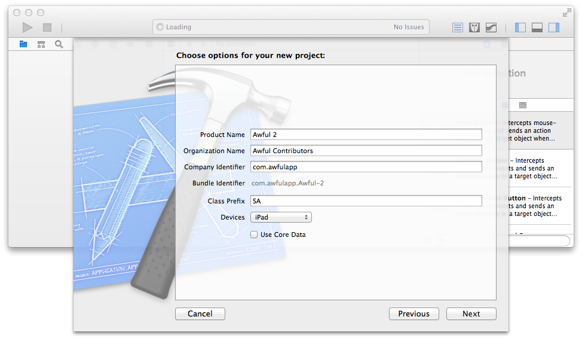

File → New → Project
====================

Three months ago, I wrote to the [Awful][] design cabal (aka Diabolik900, pokeyman (that's me!), and The Dave):

> Now don't worry, I'm not literally opening Xcode and clicking "New Project", we're not embarking on a year-long death march. 

Tonight, I did this:

But I should back up and explain. Awful is a Something Awful Forums app for iOS. It's meant to make reading and posting on the Forums more pleasant on iPhones, iPads, and iPods touch. It's an entirely volunteer project, the app is free in the store, and the code is open to all. It's been developed over the years, through two new versions of iOS, and has many thousands of users.

Enter iOS 7. It looks completely different. There's a ton of new features we can use. And it forces a tough decision, one that I had originally made in the other direction. But I've made up my mind.

Awful 2 is a brand-new app. It requires iOS 7. And there's really one reason.

*Crashes.*

Awful 1 displays posts in a [web view][UIWebView]. It was like that when I took over, and I [defended using a web view][UIWebView defense]. The salient point was that since we get the posts as HTML, we should use the excellent HTML renderer that comes with the OS. There were some bridges to cross but it largely worked.

Or so I thought. Six months ago I set up Awful 1 with Crashlytics and the crash logs poured in. We fixed a lot of bugs. But there are thousands of crashes from that web view we use to display posts. I'm out of ideas. I don't know how to fix them. I've followed the tracebacks into and out of the WebKit source, I've read every blog and forum post I can find about web view trickery. The crashes keep coming.

The answer is obvious: ditch the web view. Take more control. If the crashes come from my own code, at least I have a chance to fix it.

That simple answer belies a lot of work. I wasn't sure I wanted to figure out parsing and rendering that HTML. Then iOS 7 came along and I saw how much work it would be to even pretend to look right. I have time. We can make this happen. Fuck it, let's go.

iOS 7 brings Text Kit, perfect for rendering posts. A new HTML parser does away with hacking around [an old XML parser][libxml2]. State preservation. Background updates. (Did you notice that the "use Core Data" box is not ticked?) And maybe, if we're lucky, we can show you a page of animated GIFs without bringing your device to its knees.

[Awful]: https://github.com/AwfulDevs/Awful
[libxml2]: http://www.xmlsoft.org/
[UIWebView]: http://developer.apple.com/library/ios/documentation/uikit/reference/UIWebView_Class/Reference/Reference.html
[UIWebView defense]: http://forums.somethingawful.com/showthread.php?threadid=3510131&pagenumber=4&perpage=40#post408802595
