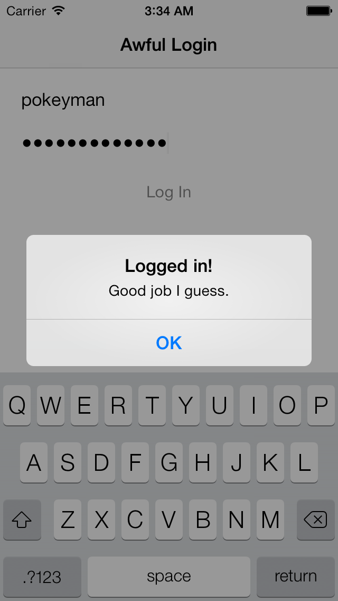

Log In Please
=============

The Something Awful Forums won't show you much unless you log in. So the first thing Awful 2 needs to do is let you log in. That means we need:

- Some way to send a username and password to the SA Forums.
- Some way to know if they worked.
- Some way to know who's logged in.
- Some way to type in a username and password.

The respective answers are:

- Send an HTTP POST request using [AFNetworking][] with hard-coded form names and hidden values.
- Check for a 200 response code.
- Check for a cookie from `forums.somethingawful.com` setting a value for the name `bbuserid`.
- Make a view controller!

AFNetworking is a fantastic library. I originally fell in love with it because it simply wrapped an NSURLConnection in an NSOperation. Way easier to use and reason about. I'm still using it because of various little goodies, most pertinent being its encoding of form parameters. It's in the process of being rewritten to use the new NSURLSession stuff in iOS 7. Nice to know there's something to fall back on if AFNetworking starts bothering me.

Oh, I installed AFNetworking using CocoaPods. I dislike many things about CocoaPods, but it's still better than installing and updating libraries by hand. I might get mad at it some day but it's OK for now.

After setting that up, it's time to make a login form. For me, that means my first foray into Auto Layout. This is my first app whose minimum requirement admits Auto Layout. So far it seems pretty easy! The visual format language is much nicer than coding stuff by hand. I'll probably start complaining once I delve into trickier layout tasks.

And the grand finale: making the app universal. I'm not sure why I thought it sensible to start with just iPad. I use Awful on my iPad way more than anywhere else, but it's at least functional on the iPhone so let's let it fly.

Today's milestone: a Something Awful Forums Username and Password Checker:

[AFNetworking]: https://github.com/AFNetworking/AFNetworking
