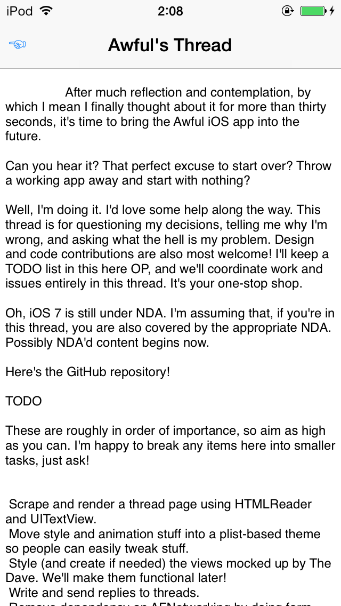
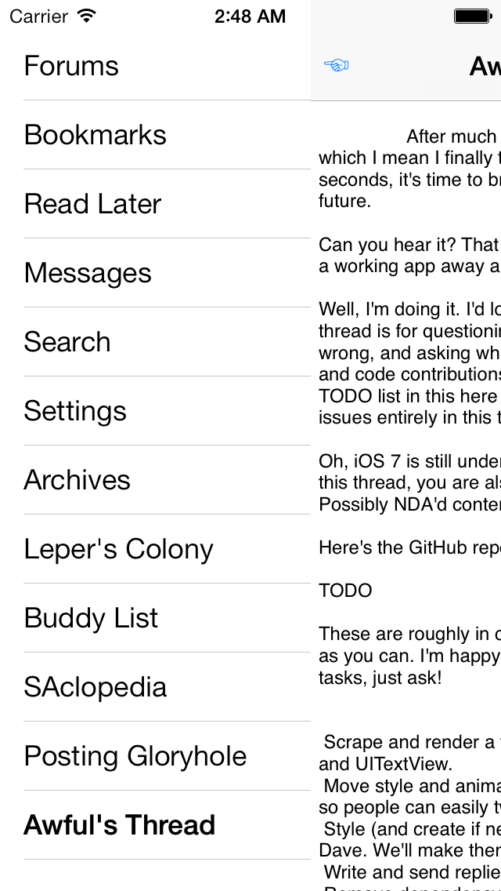

First Post
==========

Over the last couple days I've assembled the beginnings of an actual user interface. There's the main tab bar-like "basement" view (there ought to be a good name for that, where you lay the tabs out vertically beneath the main view). And now we can render a post:

Clearly this is a pale imitation of the actual rendering job we want to do. And it only takes several seconds to lay out the [first page of posts][]. But we're off!

Auto Layout worked wonderfully for the basement view. Implementing a pan gesture recognizer to drag the main view over was quite simple: add a constraint at a higher priority and twiddle its constant. Propping the basement open (now that's a tortured metaphor) is simply adding a new required constraint. Remove that constraint and the basement slams shut. Way more enjoyable to write than the old `-setFrame:` gunk. Here's the unstyled result:

[first page of posts]: http://forums.somethingawful.com/showthread.php?threadid=3564303&pagenumber=1&perpage=40
