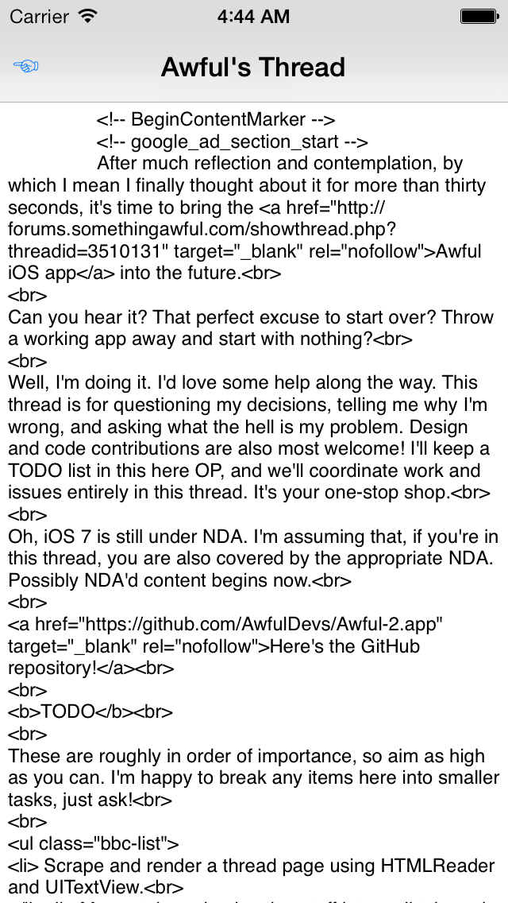

Models
======

Tonight I decided it was finally time to get some models involved. Forums, posts, threads, and users are now represented in Awful 2. For now they're plain old NSObjects, but that might change once a database gets involved.

A mistake in Awful 1 was to have the network client sometimes return model instances. For example, `AwfulHTTPClient` defined methods like

    - (NSOperation *)listThreadsInForumWithID:(NSString *)forumID
                                       onPage:(NSInteger)page
                                      andThen:(void (^)(NSError *error, NSArray *threads))callback;

where the callback receives an array of `AwfulThread` instances, and

    - (NSOperation *)learnUserInfoAndThen:(void (^)(NSError *error, NSDictionary *userInfo))callback;

where the callback receives a plain dictionary. This is dumb for two reasons:

1. Code asking for a list of threads needs to know about the network client.
2. The network client needs to know how to parse and make `AwfulThread` instances.

Awful 2 corrects this by having (in this case) the `SAForum` instance do the work of listing its threads. Whether that requires a network fetch or, someday, a database query doesn't matter. The caller just gets the info they requested.

There's an API question to solve here once we do cache data locally, and that's whether and how to retrieve data both from the cache and from the network. Ring the callback twice? Have the callback wait even when we have an answer available right now? Allow callers to specify the cache behavior?

Unfortunately, in order to start rendering a post's HTML contents, I needed a way to actually *retrieve* a post's HTML contents. HTMLReader can now serialize HTML fragments (JavaScript developers familiar with the DOM know this as `innerHTML`)!

Finally, I switched to a better fix for that annoying Xcode 5 Developer Preview console spam. It doesn't depend on a third-party library, and even excepting that library it's less code.

This push towards a respectable posts view is turning into quite a slog. Next step is to start rendering posts' HTML contents nicely, and add the typical adornments around the post (author's username, avatar, post data, etc.). By then it'll start looking like an app someone might use one day.

Oh, and I guess the app has identifiably changed in some way, so here's a recent photo:

