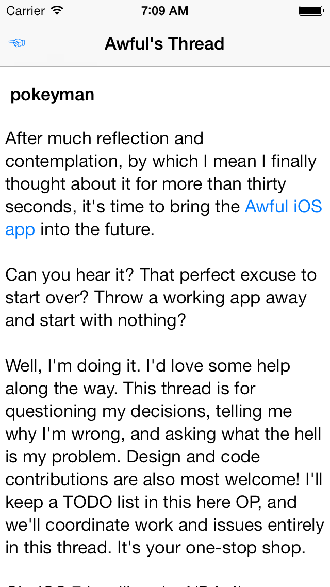

Start Rendering HTML
====================

Check out some basic UITextView HTML rendering:

I've also started wrangling the collection view into properly showing posts. The author's name appears above each post, and the divider is a proper footer view. The old divider between posts was actually the collection view's background color showing through, which also showed through the semitransparent navigation bar and looked dreadful. That's all fixed now.

By far the most annoying part of getting this rendering going was calculating the height of a rendered post. UIKit adds some methods to NSAttributedString that will calculate the rectangle needed for drawing, but using this method is far from straightforward. You must be stringent with the font attribute (avoid `-[NSAttributedString initWithString:]`), you must pass the right options to the `-boundingRectWithSize...` method, and then you must adjust its output. This difficulty is probably my own fault. The `-boundingRectWithSize...` are (presumably) accurate when using methods like `-drawAtPoint:`, but I'm using an `NSLayoutManager` (indirectly, via `UITextView`) to draw the string. The Right Way would then be to ask the layout manager how much space it needs. But I don't have a layout manager until the collection view cell gets created, and blah blah blah... we'll figure something out.

I also learned something new today: if multiple scroll views have `scrollsToTop` set to `YES`, tapping the status bar does *not* scroll to the top. It took me a minute to realize where my multiple scroll views were. The obvious one was the scroll view. The tricky one was the basement's sidebar table view.

There's a bit more to do before I can leave post rendering alone for now. I'll probably take a look at quotes and images. Maybe regdates and post dates. Then it's probably on to forums and threads.
